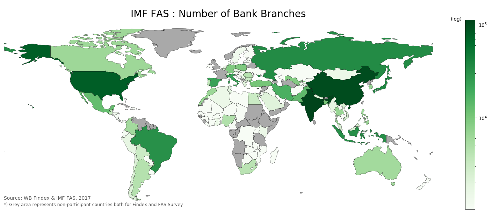
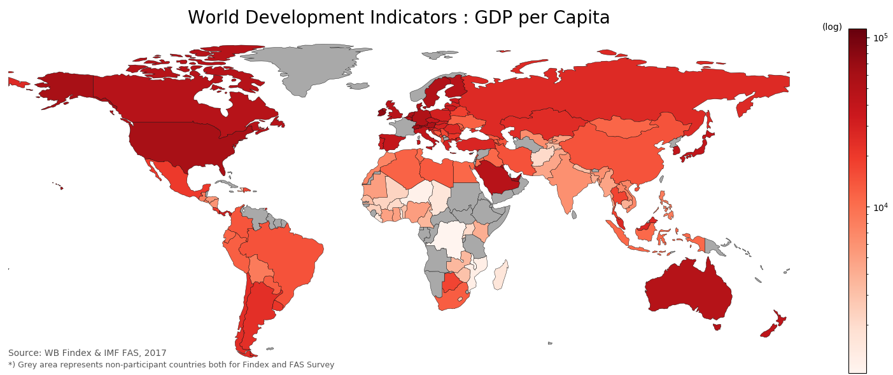
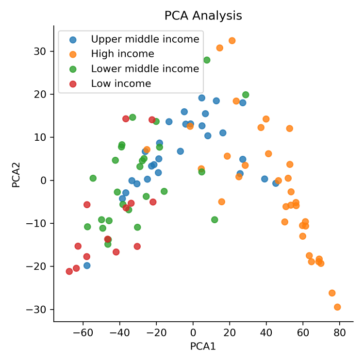

Introduction
============

In this project, we explored the 2017 **World Bank Global Financial Inclusion (Findex)** database as the latest publicly available cross-countries consumer survey data about the access of basic financial service (demand-side) in order to understand the role of financial inclusion for economic development. Example of key measures from Global Findex are the % of bank account ownership and reasons why people do not have a bank account. We also combined those with 2017 **IMF Financial Access Survey (FAS)** database to balance the information from the financial service provider perspective (supply-side). Example of key measures from FAS are the number of ATM machines and the number of bank branches in a country. The objective of this analysis is to provide policy maker with stronger rationale to design more specific intervention rather than a generic one. For example, which one should be prioritized to improve overall welfare, a free bank account for poor people or increasing the presence of bank branches network.

Data Preparation
================

**Data extraction**: We accessed the data by calling the API for both World Bank and IMF database, then parsed the JSON formatted information to get the specific parameter of the dataset. First, for each dataset, we look for _dataset\_id_ for Findex and FAS, then we pass it to another API endpoint to find the complete list of available indicators. Second, we chose several important _indicators\_id_ of our interest, then we call those indicators to get the complete data for 2017 with the help of wbdata library. We cannot utilize the _worldbank API_ within the _pandas-datareader_ since it is only work for World Development Indicators dataset, not for the other dataset like Global Findex.

**Data cleaning**: Since our main dataset is Findex, we are using the available Findex indicators and countries as an anchor for the other datasets. We detected 17 columns contain NA in all rows, meaning that the indicator is obsolete or changed in 2017 survey (previously available Findex dataset is for 2011 and 2014) thus need to be removed from the dataset. Further, we only retrieve 5 indicators from FAS to fill in the important gap about financial service provider which cannot be found on the Findex dataset. We treated several NAs of non-reporting country for each specific indicator by replacing it with the mean. This step was taken given the NAs is considerably small (less than 10% of reporting countries) and because the sample represents almost all country in the world, thus collapsing into global average.

**Data merging**: After we got both of the datasets (Findex & FAS), we merged those with the help of _country\_id_ information (3-digit code) to make sure the merging process is correct without accidently removing countries which have a different name on each dataset (e.g. United States VS United States of America). The result is a main dataframe (_df\_imfwb_) with 126 rows (representing 126 countries) and 54 columns (representing 49 indicators from Findex and 5 indicators from FAS). Lastly, we add one additional column as our dependent variable in this analysis, that is GDP per capita. We did a similar API calling procedure to get the data from World Bank World Development Indicator (WDI). For the specific purpose of spatial visualization, we also imported countries shapefile data from Geopandas and add them as geometry column into our final _df\_imfwb_.

RESEARCH QUESTIONS & METHODOLOGY
================================

The main objective of this report is to provide some useful information as a starting point to design specific interventions related to financial inclusion policy and how it can contribute to improve welfare (measured by GDP per Capita). Specifically, our research questions are:

*   What aspect of financial inclusions are predictive of GDP per Capita?
*   What evidence say about the multidimensionality aspects of financial inclusion?

To answer these questions, we do these following steps:

**First**, we did an exploratory data analysis to select the highest mean for each group of indicators. For example, for account ownership set of indicators, we select account ownership of adults with secondary education or more to represent this group. And for no account set of indicators, we select no account because of insufficient funds to represent this group.

**Second**, we try to build a parsimonious regression model based on the selected indicators for each component of financial inclusion measures to predict GDP per Capita, thus specify the model as follow: \\(log(GDPpercap)=\\beta\_0+\\beta\_1(account)+\\beta\_2(financialaccount)+\\beta\_3(noaccount)+\\beta\_4(internetpayment)+\\beta\_5log(ATM)+\\beta\_6log(bankbranch)\\)

*   **Account**: has an account at formal or non-formal financial institution. This variable captures the unbanked population as the first step to a financial access.
*   **Financial Account**: has an account at formal financial institution (e.g. bank). This variable captures the next step toward better financial inclusion.
*   **No Account**: not having an account at any institution. This variable captures the reason and/or barrier for people to be part of financial system.
*   **Internet payment**: pay utilities bill with using the internet. This variable capture both people behavior and financial system readiness in promoting higher requirement to have a financial account to settle the most basic transactions (utility bill).
*   **ATM**: number of ATMs per 1,000 km2. This variable captures how convenient people can access the basic financial service.
*   **Bank Branch**: number of bank branch per 1,000 km2. This variable captures how financial service provider is allowed consumers who previously did not have access to financial services to set up accounts and get connected.

**Third**, we did the cross validation to make model selection with three different models Linear Regression, Stochastic Gradient Descent Regression, and Polynomial Regression with degree 2 with the k-fold is being set equal to 5. We choose those models because we want to predict continuous target variable which is GDP per Capita. We evaluate the performance from each model using scoring on R^2 and Negative Mean Squared Error.

**Fourth**, we run the estimation with similar model we used in cross validation. We prepare the data with randomly split data with 20% test set. We use Mean Absolute Error, Mean Squared Error and Root Mean Squared Error to find the prediction performance on the test set. We also create plots for each model to compare the difference of the prediction from the real value.

**Fifth**, we estimate the latent variables for all variables using Principal Component Analysis (PCA) to find the common factors of financial inclusion progress across countries. This step aims to answer the multidimensionality of financial inclusion challenge in which unobserved within the definition of Findex and FAS indicators. The common factors should able to explain most of variances across country income-group and touch our sense as policy maker to look deeper on new dimension outside these survey indicators.

Estimation & Prediction Results
===============================

**Model Selection**. We got the smallest Negative MSE from Polynomial Regression which is about -0.65. This result is consistent with the visual inspection from our pair plot which showed only one feature that has some degree of non-linearity with the label (internet usage). On the other hand, we got the best R-squared value from simple OLS model, which is about 0.71. This high R-squared compared to the other two models might be overfit with our train data. Based on these results, we can safely say that the best model in predicting GDP per Capita is using the simple Linear Regression.  

**Estimation**. The estimation result showed that the most effective financial inclusion policy to improve GDP per Capita is the one which related to the Geographical Outreach. In our parsimonious regression, we used the number of ATM machine as the selected variable for Geographical Outreach category. We can interpret the coefficient (0.06) as: All else constant, for each additional 1% increase in ATM per 1000km, we expect about 0.06% increase in GDP per capita. This tells us that one of the most basic needs of a country to progress toward better financial inclusion and achieving welfare improvement is by spreading more access point to the basic financial services (e.g. ATM and bank branch).

**Prediction**. Using OLS, the result of our parsimonious regression is the best one compared to Polynomial Regression and SGD Regression. The small sample size may explain why the test set also performed better under OLS. With only 25 countries as the test set, it will be hard for the non-linear model to capture the whole pattern of the data, thus the linear one performs better.

**PCA**. Based on the scatter plot between PCA1 VS PCA2, we got a very interesting pattern and behavior of latent variables. We can see most of high-income countries have a high value of PCA1 and low value of PCA2. On the other hand, the rest of the income group scored a reversed pattern both for PCA1 and PCA2. We can interpret these as a barrier for a better financial inclusion. The barrier is so high thus only high-income countries can tackle this issue. One possible explanation for these are related to the financial barrier (e.g. high bank account administration cost, high transaction fee) and non-financial barrier (e.g. distance to the nearest bank, heavy documentation to open a bank account).

FURTHER WORK & IMPROVEMENT
==========================

Some of the potential further works to improve the results are:

*   Adding theoretically strong structural aspect as a control variable to mitigate the confounding factors which has not included in the model. Some macro variables are worth to consider, such as poverty rate, unemployment rate, and interest rate.
    
*   Including 2011 and 2014 Findex and FAS data into the whole analysis. Although some indicators are new and some are obsolete, some subsets of indicators consistently appeared in those 3 survey periods
